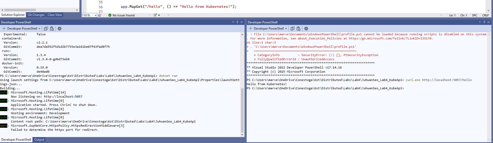
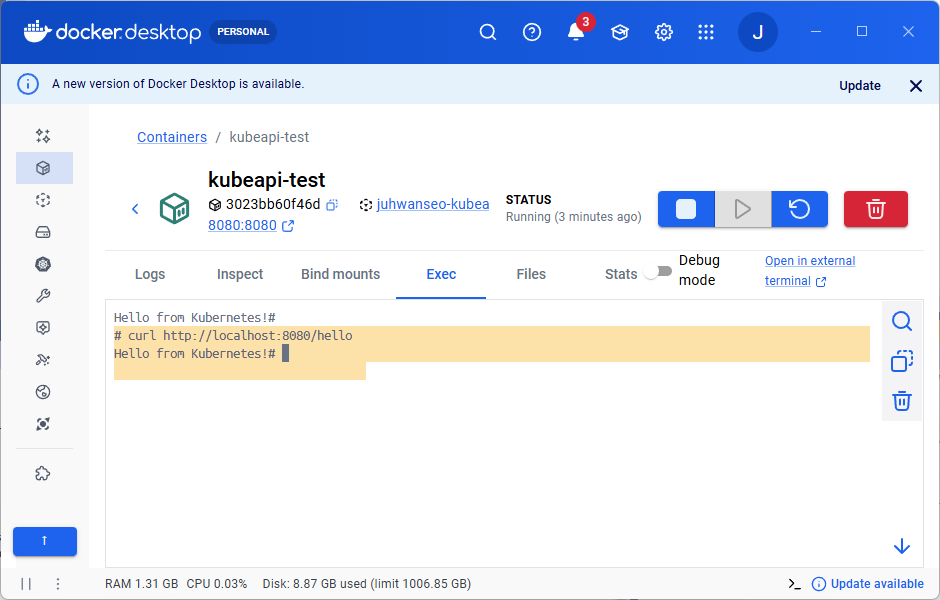
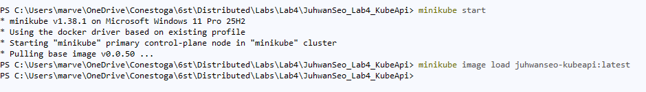
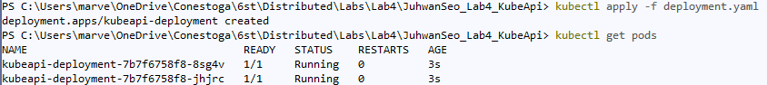
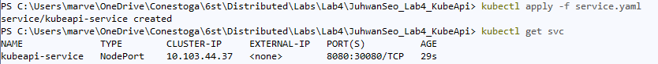

# Lab 4: Deploying a .NET Web API to Kubernetes (Minikube)

Course: PROG3176 - Winter 2026 - Section 1  
Student: Juhwan Seo [8819123]  
Date: Apr 6, 2026

---

## Description

A .NET 10 Web API with a `/hello` endpoint, containerized with Docker and deployed to Kubernetes using Minikube. Demonstrates deployment, service exposure via NodePort, scaling, and self-healing.

---

## Project Structure

| File / Folder | Description |
|---|---|
| `Program.cs` | Minimal API with `/hello` endpoint |
| `Dockerfile` | Multi-stage Docker build (SDK 10.0 -> ASP.NET 10.0) |
| `.dockerignore` | Excludes bin, obj, .git, .vs, .vscode |
| `deployment.yaml` | Kubernetes Deployment (2 replicas, `imagePullPolicy: Never`) |
| `service.yaml` | Kubernetes Service (NodePort 30080) |
| `screenshots/` | Step-by-step verification screenshots |

---

## API Endpoint

| Method | Endpoint | Response |
|---|---|---|
| GET | /hello | `Hello from Kubernetes!` |

---

## Step 1 - Local Test

```powershell
dotnet run
curl.exe http://localhost:5057/hello
```


<sub>File: screenshots/local_test.png</sub>

---

## Step 2 - Docker Build and Test

```powershell
docker build -t juhwanseo-kubeapi:latest .
docker run -p 8080:8080 juhwanseo-kubeapi:latest
curl.exe http://localhost:8080/hello
```


<sub>File: screenshots/docker_test.png</sub>

---

## Step 3 - Minikube Start and Image Load

```powershell
minikube start
minikube image load juhwanseo-kubeapi:latest
```


<sub>File: screenshots/minikube_start.png</sub>

---

## Step 4 - Kubernetes Deployment

### 4a. Apply deployment.yaml (2 replicas)

```powershell
kubectl apply -f deployment.yaml
kubectl get pods
```

> Deployment created with 2 replicas. Both pods are in `Running` state.


<sub>File: screenshots/apply_deployment_yaml.png</sub>

### 4b. Apply service.yaml (NodePort 30080)

```powershell
kubectl apply -f service.yaml
kubectl get svc
```

> Service created with NodePort 30080 to expose the API externally via Minikube IP.


<sub>File: screenshots/apply_service_yaml.png</sub>

---

## Step 5 - API Test Through Minikube

```powershell
minikube service kubeapi-service --url
curl.exe http://<minikube-ip>:30080/hello
```


<sub>File: screenshots/k8s_api_test.png</sub>

---

## Step 6 - Scaling and Self-Healing

```powershell
kubectl scale deployment kubeapi-deployment --replicas=5
kubectl get pods
kubectl delete pod <pod-name>
kubectl get pods
```


<sub>File: screenshots/scaled_5pods.png</sub>


<sub>File: screenshots/self_healing.png</sub>

---

## Git Commit History

| # | Message | Hash |
|---|---------|------|
| 1 | Initial project setup | a96a73e |
| 2 | Added Dockerfile | — |
| 3 | Minikube start and image load | — |
| 4 | Added deployment.yaml | — |
| 5 | Added service.yaml | — |
| 6 | Verified Kubernetes deployment | — |
| 7 | Tested scaling and self-healing | — |
| 8 | Final version with README | — |